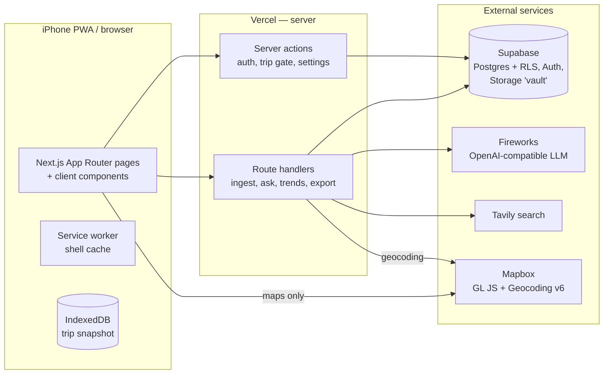

# Architecture

## Context and goals

BuscaCiudades is a personal travel companion for exactly one user on one trip
at a time (Mexico City first). The product's core loop is **ingest**: turn a
pasted booking email or URL into a structured, editable itinerary item that
fans out into a map pin and a calendar file. Everything else — Today view,
map, photo vault, grounded Ask tab, export — hangs off the items that loop
creates.

Design bias: boring, minimal, replaceable. One user means no scaling
concerns, no user management, and no tolerance for bloat.

## High-level design



Rules of the arrows:

- The browser talks to Supabase only through our server (server actions /
  route handlers) using the user's cookie session — except Mapbox GL tiles,
  which load client-side with the public token.
- `SUPABASE_SERVICE_ROLE_KEY`, `INFERENCE_API_KEY`, and `SEARCH_API_KEY`
  exist only on the server. Every LLM call and every search call is a server
  route.
- Auth session cookies are refreshed by `proxy.ts` (Next 16's middleware),
  which also gates authenticated routes and bounces logged-in users off the
  landing page.

## Data model

Four tables plus a counter, all with RLS `user_id = auth.uid()`. Canonical
DDL lives in [supabase/migrations/](../supabase/migrations/) — that directory
is the source of truth for the database, and every migration applied to the
live project is committed there.

- **trips** — one active trip at a time (`status: active | archived`); trip
  dates, lodging (name/address/coords).
- **items** — everything on the itinerary. Category enum (`flight | ticket |
  accommodation | dining | excursion | transport | note`) drives color;
  `kind` (museum, restaurant, bar…) drives the display ID prefix. Times are
  stored UTC (`starts_at`/`ends_at`) with an IANA `venue_tz`, and **all times
  render in venue tz**. Extraction fields are explicit columns (amounts,
  confirmation codes, purchaser contact, confidence). Three traceability
  timestamps on every row: `source_issued_at`, `ingested_at`, `starts_at`.
- **attachments** — Vault entries; storage path into the private bucket,
  EXIF `taken_at` when present, optional `item_id` link.
- **ask_log** — one row per Ask query; drives the server-enforced rate limit
  and history.
- **display_id_counters** — per-trip, per-kind sequence backing display IDs.

Display IDs are `PREFIX-NNN` (`MUS-001`, `FLT-002`…), assigned server-side
via the `next_display_id()` SQL function — an atomic upsert on the counter
table, so concurrent inserts can't collide. The kind→prefix map lives in
[lib/display-id.ts](../lib/display-id.ts).

Dedupe: `content_hash` = sha256 of normalized source text, unique per trip
(partial index). A duplicate paste surfaces "Already imported as
[DISPLAY_ID]", never a raw DB error.

## Security model

- **Allowlist of one.** The signup server action rejects any email except
  `ALLOWED_USER_EMAIL`, and a `before insert` trigger on `auth.users`
  (SECURITY DEFINER, EXECUTE revoked from client roles) enforces the same
  at the database layer. Two independent gates.
- **RLS everywhere.** Verified by attempting cross-user reads with the anon
  key (returns empty).
- **Private vault.** Storage policies scope objects to
  `{user_id}/...` paths; the app hands out short-lived signed URLs.
- **No client secrets.** Checked by convention (`NEXT_PUBLIC_` prefix
  discipline) — service role, inference, and search keys are only read in
  server code.

## Key decisions

| Decision | Why |
|---|---|
| Server actions for auth/trip-gate, route handlers for ingest/ask/export | Actions give free progressive enhancement for forms; route handlers suit JSON pipelines and downloads |
| Hand-written row types ([lib/types.ts](../lib/types.ts)) instead of codegen/ORM | Five tables; the types fit on one screen; zero deps |
| `proxy.ts` (not `middleware.ts`) | Next 16 renamed the convention |
| Times stored UTC + `venue_tz` column, converted at the edges | One canonical storage form; rendering is always explicit about tz |
| Display IDs via SQL upsert function | Race-safe without transactions-in-JS gymnastics |
| Icons generated by `scripts/make-icons.mjs` from inline SVG | No design-tool dependency; regenerate with one command |
| Service worker caches shell only; trip data snapshots to IndexedDB (M4) | Server is the source of truth; no sync-conflict logic by design |

## Ingest pipeline (M3 — the product)

```
"+" sheet (paste text | URL)
  → URL: server fetch → strip to readable text ; paste: as-is
  → normalize → sha256 → dedupe check against items.content_hash
  → one extraction route: one prompt, strict JSON, zod-validated
      (retry once feeding the validation error back;
       still failing → review card opens in manual mode, raw text visible)
  → geocode venue_address (fallback: venue_name + "Mexico City")
      low confidence → flagged on the card, editable
  → review card: every field editable, three toggles
      (itinerary / pin / calendar), nothing writes until…
  → "Add to trip": item + pin + .ics (VALARM 45 min; 3 h for flights)
```

`source_type` already reserves `screenshot` and `email` for fast-follows.

## Offline posture

Service worker caches the app shell (static assets cache-first, navigations
network-first with cached fallback). On each load the app snapshots the
active trip payload to IndexedDB (M4); offline, Today/Itinerary/Map render
read-only from the snapshot with one quiet banner. No sync-conflict logic —
the server is the source of truth.
